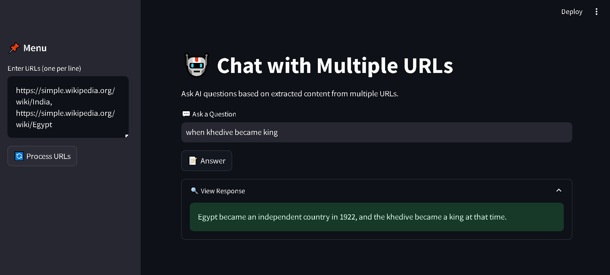

# Chat with Multiple URLs 



## 📌 Project Overview
This Streamlit application allows users to input multiple URLs, extract content from them, and ask AI-powered questions based on the extracted data. It utilizes **Google Generative AI**, **FAISS for vector storage**, and **LangChain** for efficient text processing and retrieval.

## 🚀 Features
- **Extracts text** from multiple URLs using BeautifulSoup.
- **Splits text into chunks** for effective vector storage.
- **Stores embeddings** using FAISS for similarity searches.
- **Processes user queries** and generates AI-powered answers.
- **Interactive UI with Answer Button** to trigger responses explicitly.

## 🛠️ Tech Stack
- **Python**
- **Streamlit** (UI Framework)
- **BeautifulSoup** (Web Scraping)
- **LangChain** (Text Processing & Question Answering)
- **FAISS** (Vector Storage & Retrieval)
- **Google Generative AI** (LLM API)
- **Dotenv** (Environment Variables)

## 🏗️ Installation
### 1️⃣ Clone the Repository:
```bash
git clone https://github.com/your-repo/chat-with-multiple-urls.git
cd chat-with-multiple-urls
```

### 2️⃣ Install Dependencies:
```bash
pip install -r requirements.txt
```

### 3️⃣ Set Up Environment Variables:
Create a `.env` file and add your Google API key:
```
GOOGLE_API_KEY=your_google_api_key_here
```

### 4️⃣ Run the Application:
```bash
streamlit run app.py
```

## 📖 Usage Guide
1. **Enter URLs** (one per line) in the sidebar.
2. Click **'Process URLs'** to extract and store text.
3. Type your question in the input box.
4. Click **'Answer'** to get AI-generated responses.

## 🔍 Example Output
```
User: What is the main topic of these articles?
AI: The main topic discusses advancements in AI technology...
```


## 📜 License
This project is licensed under the **MIT License**.

